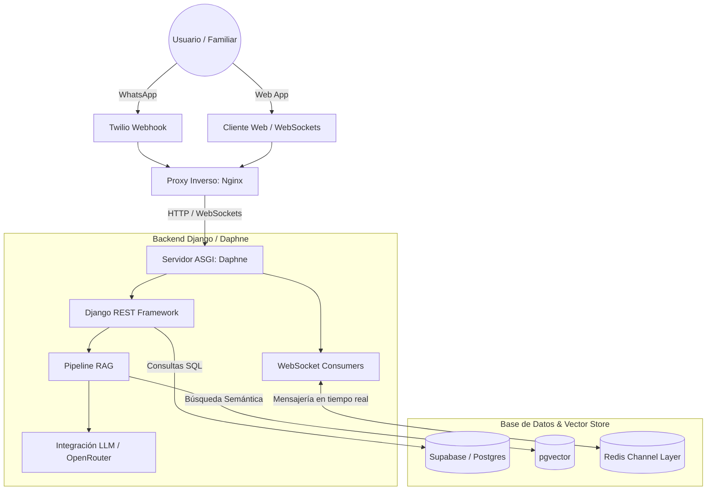

# 🇻🇪 Chatbot Venezuela

Bienvenido a la organización oficial de **Chatbot Venezuela**. Este espacio reúne los diferentes módulos y repositorios que dan vida a un asistente conversacional inteligente diseñado para brindar apoyo, orientación e información en tiempo real a ciudadanos, organizaciones y familiares.

El sistema combina el poder de los **Modelos de Lenguaje de Gran Escala (LLMs)** con tecnologías de **Recuperación Aumentada por Generación (RAG)** y conexiones multi-canal (WhatsApp, Web, etc.).

---

## 🗺️ Mapa de Repositorios

Nuestra arquitectura está dividida en componentes desacoplados para garantizar la escalabilidad y mantenibilidad del sistema:

*   **[chatbot-vzla-backend](https://github.com/chatbot-vzla/chatbot-vzla-backend):** El núcleo del sistema. Desarrollado en **Django 6** y **Django Channels** para el flujo asíncrono y WebSockets. Maneja la persistencia, la lógica de negocio, integración con LLMs y la base de datos PostgreSQL vectorizada.
*   **[chatbot-vzla-frontend](https://github.com/chatbot-vzla/chatbot-vzla-frontend):** Interfaz administrativa y de chat interactiva desarrollada en tecnologías modernas para consumo rápido de la API.
*   **[chatbot-vzla-scraper](https://github.com/chatbot-vzla/chatbot-vzla-scraper) (o sub-módulo):** Pipeline de extracción de datos automatizado para alimentar la base de conocimiento (OSINT, Sheets, registros públicos).

---

## 🏗️ Arquitectura del Sistema

El siguiente diagrama detalla cómo fluyen los datos a través del ecosistema de Chatbot Venezuela:

---

## 🛠️ Stack Tecnológico Global

*   **Lenguajes:** Python 3.12+, JavaScript/TypeScript.
*   **Backend Framework:** Django 6.0 + Django REST Framework (APIs).
*   **Asincronía & Tiempo Real:** Django Channels + Daphne + Redis (como backend de canales).
*   **Base de Datos Vectorial:** PostgreSQL (alojado en Supabase) + extensión `pgvector` para búsqueda de similitud coseno de embeddings.
*   **Proxy e Infraestructura:** Docker & Docker Compose para empaquetamiento, Nginx como proxy inverso (con WebSockets habilitados), Certbot para certificados SSL automáticos.
*   **IA / LLM:** Embeddings vectoriales personalizados e integraciones con APIs de lenguaje de última generación.

---

## 🤝 Cómo Contribuir

¡Nos encanta recibir aportes de la comunidad! Si quieres contribuir a alguno de los repositorios de la organización:

1.  **Explora los tableros de proyecto (Kanban):** Revisa la pestaña **Projects** de la organización para ver las tareas prioritarias en el Backlog.
2.  **Crea un Fork:** Haz un fork del repositorio en el que desees trabajar.
3.  **Crea una rama de característica:** `git checkout -b feature/mi-nueva-caracteristica`.
4.  **Haz commits limpios:** Sigue las convenciones de commits descriptivos.
5.  **Abre un Pull Request:** Dirige tu PR a la rama principal (usualmente `main` o `develop`) detallando el cambio y adjuntando capturas de pantalla/pruebas si es relevante.

---

## 🛡️ Seguridad y Buenas Prácticas

*   **Variables de Entorno:** Nunca subas archivos `.env` o llaves privadas al repositorio. Asegúrate de que el `.gitignore` esté activo.
*   **Entornos de Desarrollo:** Para pruebas de WebSockets o simulaciones de API, haz uso del modo `DEBUG=True` controlado dinámicamente mediante el script `./start.sh dev`.

---

  Hecho con ❤️

